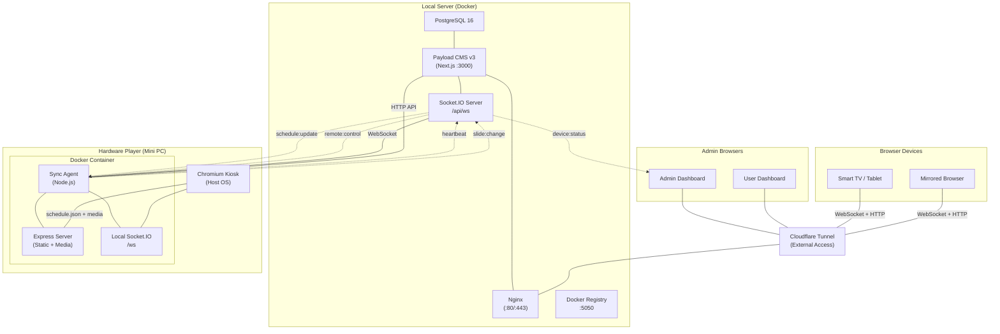
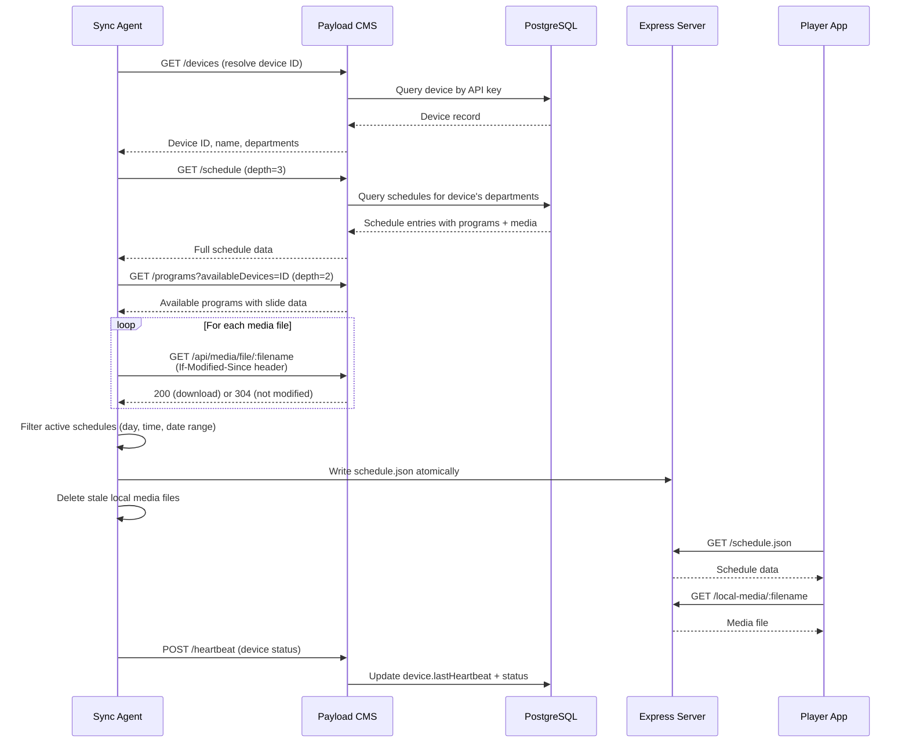
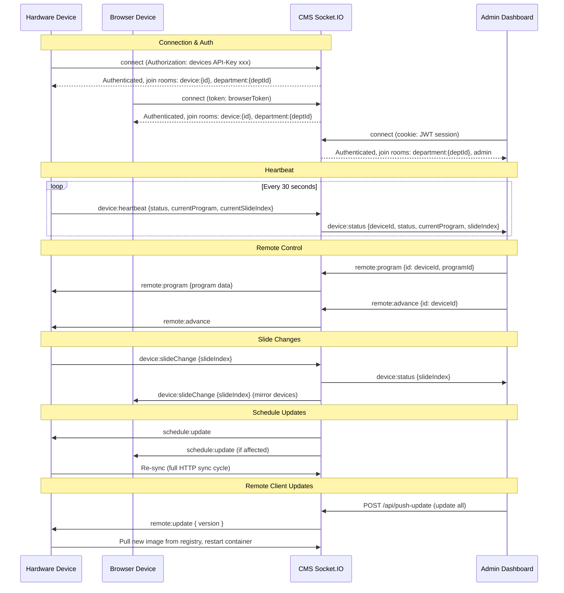
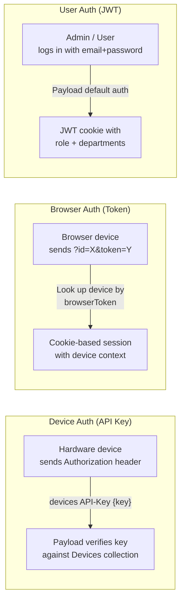
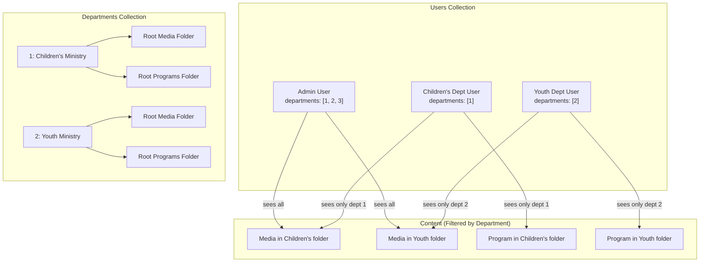
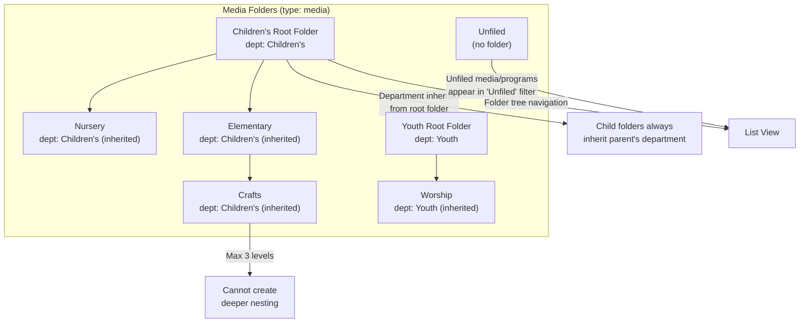
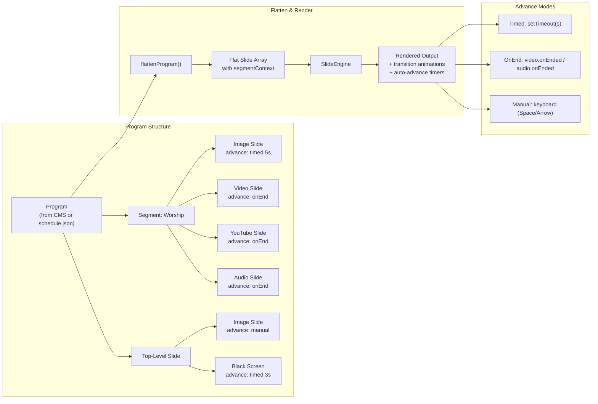
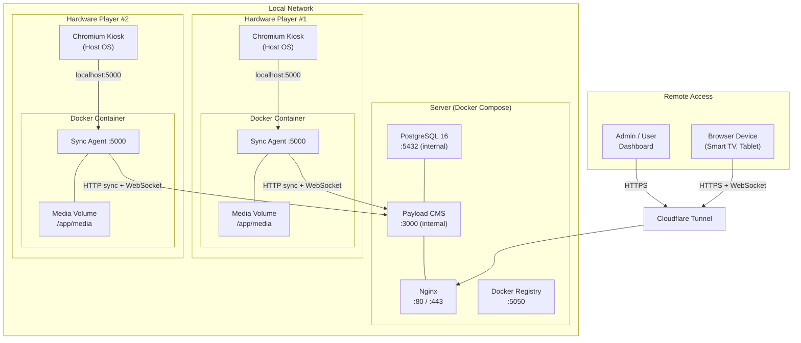
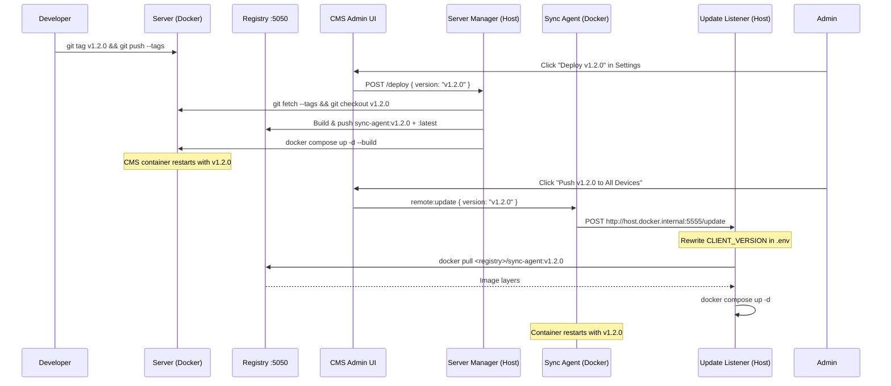

# Architecture

System architecture for PeydX — a multi-tenant church education and classroom presentation platform with digital signage.

## System Overview



## Components

### Server (`apps/server/`)

Payload CMS v3 running inside Next.js, serving the admin dashboard and REST API. Collections define the data model (Users, Departments, Media, Programs, Schedule, Devices, Folders). Hooks enforce access control, auto-create slides from bulk media, inherit folder departments, and emit WebSocket events on data changes.

### Player (`apps/player/`)

React + Vite single-page application. Detects its mode from URL parameters:
- **Hardware mode** (default) — connects to the local sync agent via WebSocket and fetches `schedule.json` for fully offline playback.
- **Browser mode** (`?id=X&token=Y`) — connects directly to the CMS via WebSocket and fetches programs from the API. Requires internet.
  - Both modes accept optional `&program=<id>&slide=<index>` to automatically load an available program at a specific slide on startup.
- **Version self-check** — on build, `dist/version.json` is written with the current git hash. The player polls this file every 5 minutes and reloads if the hash differs, picking up new code without manual refresh.

### Signage Core (`packages/signage-core/`)

Shared package containing the slide rendering engine:
- **SlideEngine** — renders the current slide with transitions (fade, cut, slide, zoom) and advance logic (timed, on-end, manual)
- **MenuEngine** — full-screen overlay for program selection
- **PlayerController** — manages player state (idle, menu, playing) and keyboard input
- **flattenProgram** — expands segments into flat slide arrays with context

### Sync Agent (`sync/sync-agent.js`)

Node.js background process, deployed as a Docker container (`docker-compose.client.yaml`) or via PM2. Handles:
- Resolves device identity from the CMS using its API key
- Fetches active schedules and available programs
- Downloads media files (preferring fullHD sizes) with conditional `If-Modified` requests
- Writes `schedule.json` atomically (write to `.tmp`, then rename)
- Serves the player app and media on port 5000 via Express
- Connects to CMS via Socket.IO for real-time updates; falls back to 60-second HTTP polling
- Sends heartbeats for the device health dashboard
- Forwards WebSocket events between the local player and the CMS

## Sync Data Flow



## WebSocket Event Flow



> **Browser devices** do not receive `remote:update`. Instead, the standalone player polls `/version.json` every 5 minutes and reloads when the git hash changes, picking up a new build without manual refresh. The `version.json` file is written during `vite build` by a Vite plugin that embeds `git rev-parse HEAD` into both the build output and the `__GIT_HASH__` compile-time constant.

## Authentication Flow



All three auth methods converge on a Socket.IO middleware that validates identity and assigns rooms:

- **Device API key** → `device:{id}` room + `department:{deptId}` rooms
- **Browser token** → `device:{id}` room + `department:{deptId}` rooms
- **User JWT** → `department:{deptId}` rooms (+ `admin` room if admin role)

## Department Isolation



Department filtering is enforced at the access control layer in every collection:

- **Users** have a `departments` hasMany relationship saved to their JWT
- **Media** and **Programs** belong to a `folder` which belongs to a `department`. Access control filters by `folder.department`
- **Schedule** entries infer their `department` from the selected program's folder. Admins see all; standard users see schedules in their departments; devices bypass department filter (the `devices[contains]` query already scopes results)
- **Folders** belong to a `department`. Child folders inherit department from their parent (non-overridable). Basic users see folders in their departments only
- **Devices** have `departments` hasMany. A device can display schedules from multiple departments. Basic users can manage devices in their own departments

The generic pattern used in access control hooks:

```typescript
const deptIds = (user.departments || []).map((d: any) =>
  typeof d === 'object' ? d.id : d
)
// Then filter: { 'folder.department': { in: deptIds } }
```

## Folder Organization



Key rules:
- **Two separate trees**: `media` and `programs` folder types, each with their own root per department
- **Department inheritance**: When a department is created, root media and programs folders are auto-created. Child folders inherit department from their parent — it cannot be overridden
- **Max 3 levels deep**: Root (level 1) → Subfolder (level 2) → Sub-subfolder (level 3). Deeper nesting is blocked by a `beforeChange` hook
- **Auto-assignment**: When creating media or programs, the `folder` field is hidden and auto-assigned from the user's `current-folder` preference, falling back to the department's root folder
- **Delete protection**: Folders containing items or sub-folders cannot be deleted
- **Unfiled**: Items without a folder appear under the "Unfiled" filter in the list view

## Slide Engine Rendering Pipeline



The rendering pipeline:

1. **Load program** — `PlayerController` resolves the active schedule entry and loads the program
2. **Flatten** — `flattenProgram()` expands segments into a flat `Slide[]` array. Each slide gets a `segmentContext` with background audio, loop settings, and position within the segment. `SegmentBoundary` entries track segment start/end indices
3. **Render** — `SlideEngine` renders the current slide with its configured transition. Handles:
   - **Image slides**: Dual-layer rendering (blurred backdrop + contained foreground)
   - **Video slides**: HTML5 video player with on-end detection
   - **YouTube slides**: Iframe API integration with auto-play and loop
   - **Audio slides**: HTML5 audio with on-end detection and optional background audio for segments
   - **Black screen slides**: Black overlay with timed or manual advance
4. **Advance** — When a slide ends (by timer, video end, or keyboard input), `SlideEngine` triggers the transition to the next slide. If the program ends and looping is disabled, an "End of program" overlay appears

## Deployment Architecture



- **Server**: Runs Payload CMS + PostgreSQL + Nginx in Docker on a local machine (Intel Core i5 minimum). All inter-container communication is internal. A named Docker volume (`media_data`) stores uploaded media.
- **Hardware players**: Mini PCs on the same local network. The sync agent runs in a Docker container (`docker compose -f docker-compose.client.yaml up -d`) pulling a pre-built image from the server's registry — no local build or git clone needed. Media is stored in a named Docker volume for persistence. The Chromium kiosk runs on the host OS for direct GPU access.
- **Cloudflare Tunnel**: Provides secure external access to the CMS admin panel and WebSocket connections without opening inbound ports. Handles TLS termination and DDoS protection.
 - **Browser devices**: Connect directly to the CMS through the Cloudflare Tunnel. Require internet but no local software. A browser device can mirror a hardware player's display by setting the `controllingDevice` field.
- **Admin access**: Users, managers, and admins access the CMS dashboard through the Cloudflare Tunnel for managing media, programs, and schedules.
- **Docker Registry**: A local registry on port 5050 stores pre-built sync-agent images. Client devices pull from this registry during remote updates.

## Remote Updates



Since this is a monorepo, a single git tag represents both server and client code. The deploy action handles everything in one step:
1. Developer pushes a git tag (e.g. `v1.2.0`)
2. Admin clicks **Deploy v1.2.0** in the CMS Settings page — checks out the tag, builds the client image (pushed to local registry), and rebuilds the server
3. After the server restarts, admin clicks **Push v1.2.0 to All Devices** to update client devices