# PeydX — Church Education & Presentation System: User Guide

A step-by-step guide for users.

## Table of Contents

1. [Getting Started](#getting-started)
2. [Changing Your Password](#changing-your-password)
3. [Upload & Organize Media](#upload--organize-media)
4. [Create & Edit Programs](#create--edit-programs)
5. [Schedule Programs to Devices](#schedule-programs-to-devices)
6. [Remote Control](#remote-control)
7. [Dashboard](#dashboard)
8. [Tips & Common Questions](#tips--common-questions)

---

## Getting Started

PeydX lets you create slide programs for classroom lessons, children's ministry content, and digital signage — then schedule them on screens and control playback from a web browser.

### Logging In

1. Open your PeydX admin URL (e.g., `https://peydx.yourchurch.org/admin`).
2. Enter your email and password.
3. Click **Log in**.

### Navigation

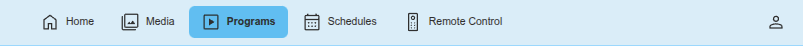

The top navigation bar is always available:

| Icon | Label | What It Does |
|---|---|---|
|  | Home | View your dashboard — device status, available programs, and upcoming schedules |
|  | Media | Upload and manage images, videos, and audio files |
|  | Programs | Create and edit slide programs |
|  | Schedules | Set up programs to play on devices at specific times |
|  | Remote Control | Take manual control of a device |
|  | Account | Change your name, email, or password |

### Your Department

Everything you see and work with is scoped to your **department(s)**. If you're assigned to "Youth Ministry," you'll only see media, programs, schedules, and devices belonging to that department. If you're in multiple departments, you'll see content from all of them.

---

## Changing Your Password

1. Click the **Account** icon (person silhouette) in the top-right of the navigation bar.
2. The Account page shows your name and email address.
3. To change your password:
   - Enter your **Current Password**.
   - Enter your **New Password**.
   - Confirm your **New Password** in the repeat field.
4. Click **Save** to apply the change.

You can also update your name or email on this page.

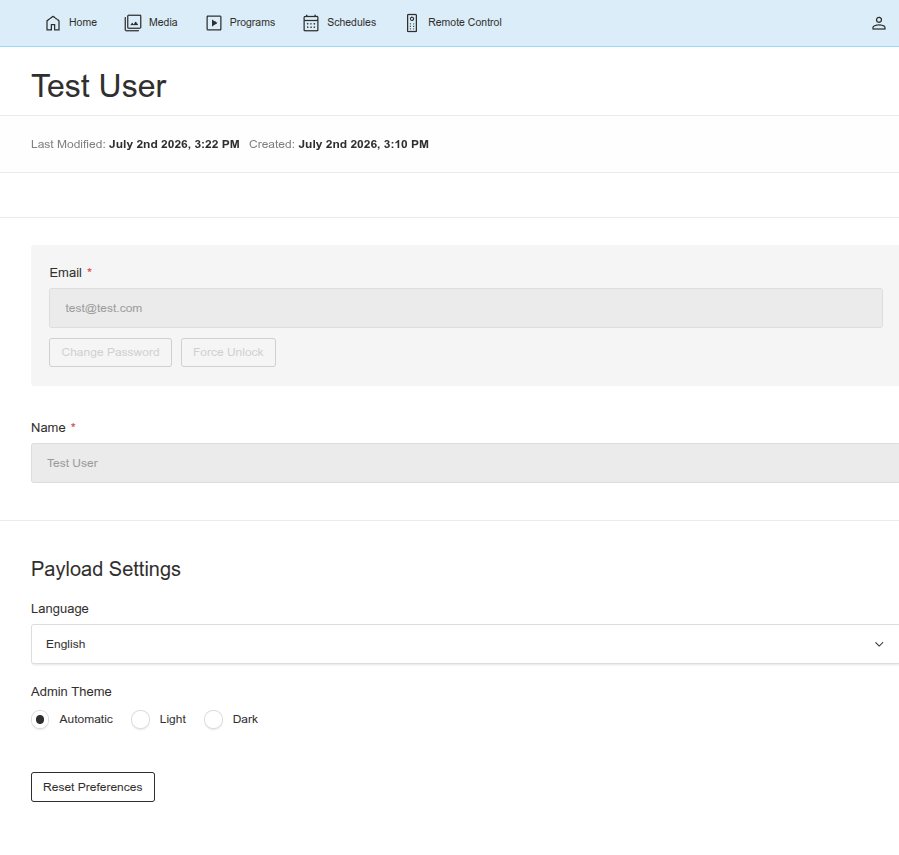

---

## Upload & Organize Media

Before you can add images or videos to a program, you need to upload them to the Media library.

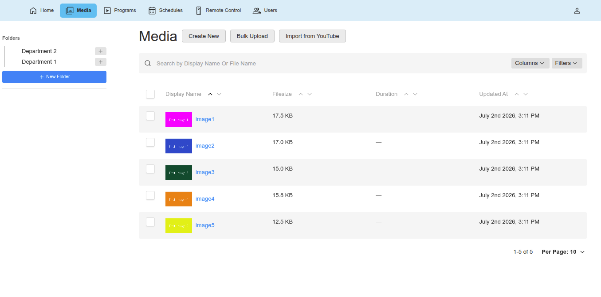

### Uploading a Media File

> **Select the right folder before uploading.** New uploads are automatically placed in whatever folder you currently have selected in the sidebar. If you don't select a folder first, your files will end up in the department root folder — which gets cluttered quickly. We recommend creating folders for your content (see "Organizing Media into Folders" below) and clicking the destination folder before you upload.

1. Click **Media** in the top navigation.
2. **Click on the folder** in the sidebar where you want the upload to go. This is important — new uploads are automatically placed in the selected folder. If you skip this step, files go to the root folder.
3. Click the **Create** button at the top of the page.
4. Choose a file from your computer. You can upload:
   - **Images** — automatically converted to an efficient WebP format
   - **Videos** — duration is detected automatically; a thumbnail is generated
   - **Audio files** — duration is detected automatically
5. Optional: Enter a **Display Name**. If you leave this blank, the filename (without extension) is used automatically.
6. The folder is automatically assigned based on your current folder selection in the sidebar — this is why selecting the folder first matters.
7. Click **Save**.

### Organizing Media into Folders

Use the folder sidebar to keep your media organized:

- Your department has a **root media folder** created automatically.
- Click on any folder in the tree to filter the media list to that folder.
- The folder tree shows all your department's folders. Click any folder to view its contents.

> **Best practice: organize with folders.** We strongly recommend creating folders for your content rather than uploading everything into the root folder. A well-organized media library makes it much easier to find content when building programs. Good folder structures might include:
> - **Weekly lessons**: "Summer 2026" with sub-folders for each week — "Week 1 — Creation", "Week 2 — Noah's Ark", "Week 3 — Moses", etc.
> - **Content types**: "Worship Backgrounds", "Countdown Videos", "Activity Sheets"
> - **Events**: "VBS 2026", "Christmas Program 2026"

**To create a new folder:**
1. Click the **+ New Folder** button in the folder sidebar, or click the **+** button next to an existing folder to create a sub-folder.
2. Enter the folder name.
3. The folder's department is automatically inherited from its parent.
4. Click **Save**.

For example, create a folder called "Summer 2026" and then add sub-folders inside it for each week's lesson. This keeps all your weekly visuals, videos, and activity sheets neatly organized.

Folders can be nested up to 3 levels deep. You cannot delete a folder that still contains media files or sub-folders.

**To move media to a different folder:**
1. Click on a media item to edit it.
2. In the sidebar, change the **Folder** field.
3. Click **Save**.

If you've already uploaded files to the root folder, you can move them — just edit each media item and change the **Folder** field in the sidebar.

### Importing from YouTube

If your system has YouTube import enabled, you'll see an **"Import from YouTube"** button above the media table:

1. Click **Import from YouTube**.
2. Paste a YouTube video URL or video ID.
3. The video will be downloaded and added to your media library. (This may take some time - so please be patient.)

### Importing a PowerPoint File

You can import a `.pptx` file directly from the Programs page. This creates a new program with slides created from your PowerPoint content.

1. Click **Programs** in the top navigation.
2. Click the **Import PPTX** button above the program list.
3. Select a `.pptx` file from your computer.
4. If you belong to multiple departments, choose which department to import into.
5. Click **Import**.

The import process:
- Parses the file and shows progress as each media file is processed
- Creates a new **program** with your slides in order
- Creates a **media subfolder** named after your file
- Imports full-screen images, videos, and audio into that subfolder

**What gets imported:**
- ✅ Full-screen images (photos that fill the entire slide)
- ✅ Video files
- ✅ Audio files (including "play across slides" audio, which becomes a segment with background audio)
- ❌ **Not imported:** Text, shapes, logos, small graphics, charts, or complex layouts — PowerPoint slides are complex documents and this importer focuses on media content only.

> **Tips:**
> - The new program will have `advanceMode: "manual"` for images and `"onEnd"` for video/audio — you can adjust these in the program editor.
> - The program is placed in your department's programs root folder. You can move it later.
> - Depending on the file size, importing may take some time — the progress bar shows you what's happening.
> - Files over 90 MB are automatically split into chunks for upload. You'll see an "Uploading" progress step before the import begins. A **Cancel** button lets you abort the upload at any time.

---

## Create & Edit Programs

A program is a sequence of slides that plays on a screen. Think of it as a presentation or playlist.

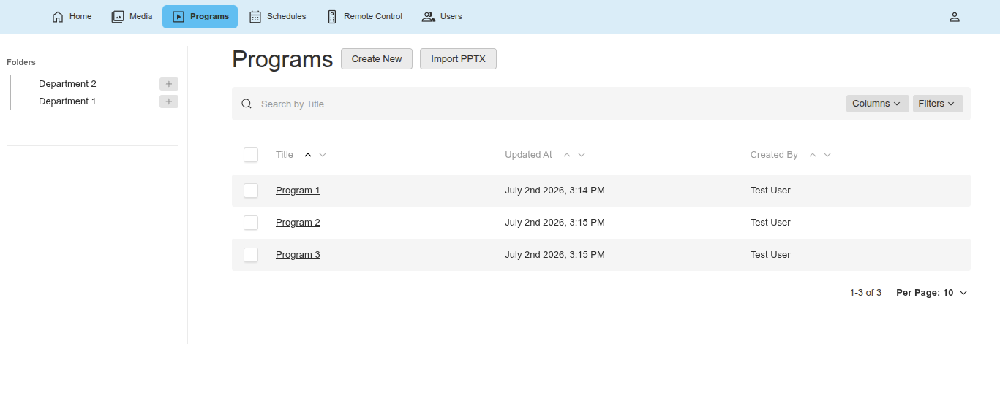

### Creating a New Program

1. Click **Programs** in the top navigation.
2. Click **Create** to start a new program.
3. Enter a **Title** — this is how you'll identify the program in schedules and on the dashboard.
4. The folder is automatically assigned based on your current folder selection.
5. Click **Save** to create the program, then start adding slides.

### Understanding the Program Editor

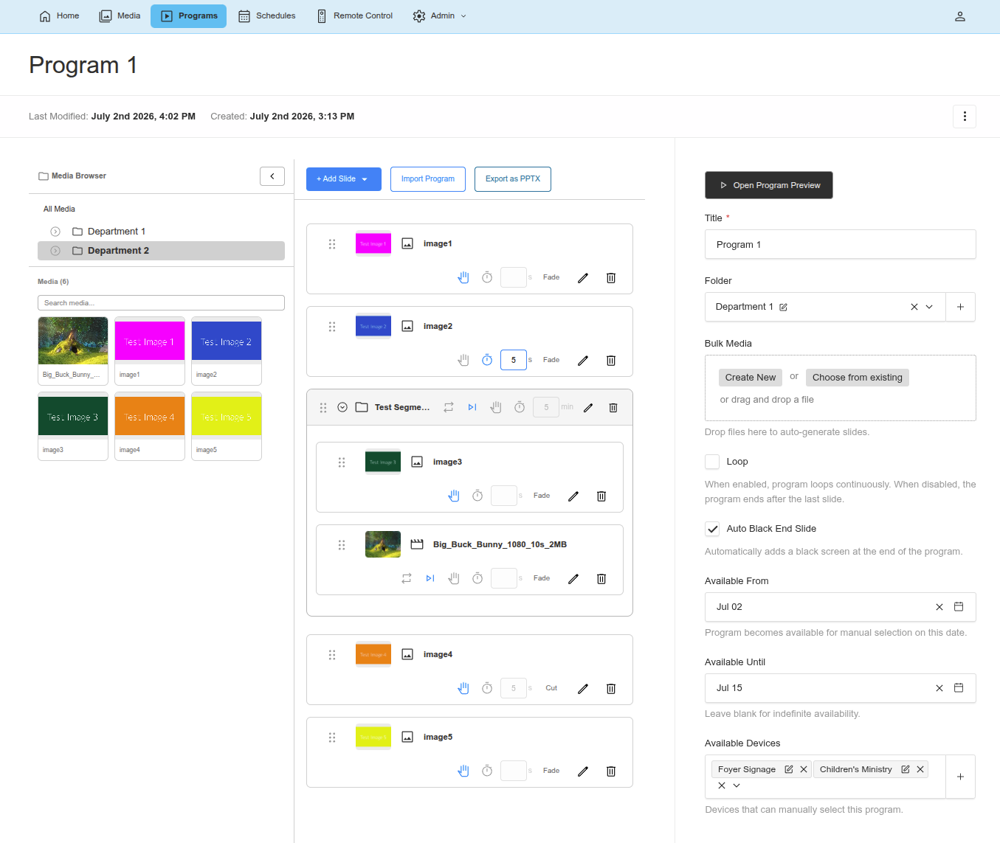

The program editor has three panels:

| Panel | Position | Purpose |
|---|---|---|
| **Media Browser** | Left side (collapsible) | Browse and search your media library. Drag items onto the timeline to create slides. |
| **Program Timeline** | Center | Your slides in order. Add, remove, reorder, and organize slides here. |
| **Sidebar** | Right side | Edit settings about the whole program. |

### Adding Slides

Click **"+ Add Slide"** in the timeline header to choose from these slide types:

| Type | What It Does |
|---|---|
| **Image Slide** | Displays an image for a set time or until manually advanced |
| **Video Slide** | Plays a video file from your media library |
| **YouTube Slide** | Plays a YouTube video (enter a URL or video ID) *Note*: This is played directly from YouTube (needs Internet connectivity)|
| **Audio Slide** | Plays audio with a speaker icon on screen |
| **Black Screen Slide** | Shows a solid black screen (good for transitions or pauses) |
| **Segment** | A container that groups slides with shared settings like background audio |

For all types except Black Screen, the Edit Drawer opens automatically so you can set up the slide. Black Screen slides are added with default settings.

### Configuring a Slide

When you click on a slide in the timeline, the Edit Drawer opens on the right. Here's what you can configure:

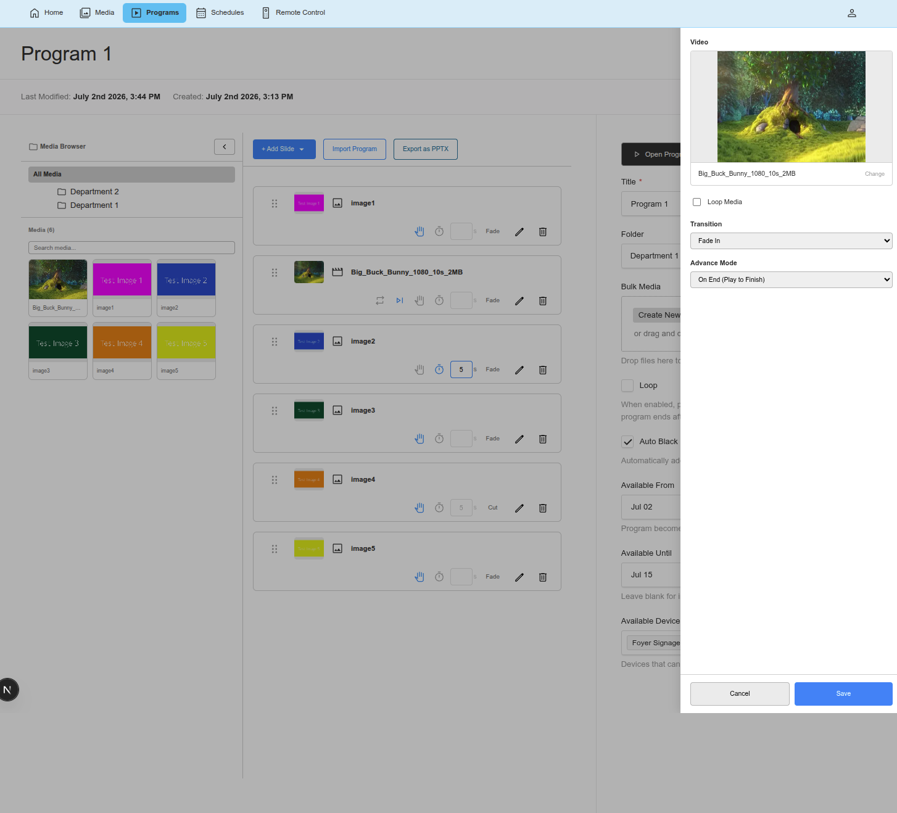

**Media Selection** (for Image, Video, Audio slides):
- Click the media field to open the media browser.
- Browse or search for your file, then select it.

**YouTube URL** (for YouTube slides):
- Paste a YouTube URL or 11-character video ID.
- Supported formats: `youtube.com/watch?v=...`, `youtu.be/...`, `youtube.com/embed/...`, or just the video ID.
- The video title is fetched automatically.

**Transition** — How the slide appears on screen:
| Option | Effect |
|---|---|
| Fade In | Smoothly fades in from the previous slide |
| Instant Cut | Immediately switches to the new slide |
| Slide Left | The new slide slides in from the right |

**Advance Mode** — When to move to the next slide:
| Option | Available On | Effect |
|---|---|---|
| Timed (Automatic) | All types | Advances after a set number of seconds (default: 5 seconds) |
| Manual (Wait for Click) | All types | Stays until someone advances it via Remote Control or keyboard |
| On End (Play to Finish) | Video, Audio, YouTube | Advances when the media finishes playing |

**Loop Media** (Video, Audio, YouTube only):
- Check this to loop the media content continuously. The slide won't advance until the advance mode triggers.

### Drag-and-Drop from the Media Browser

You can quickly add slides by dragging media from the browser directly onto the timeline:

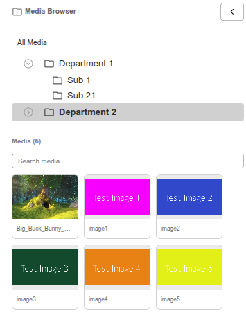

1. Open the **Media Browser** panel on the left (click the expand button if it's collapsed).
2. Browse folders and search for media.
3. **Drag** a media item from the browser onto the timeline.
4. The system automatically creates the right slide type:
   - Image files become **Image Slides**
   - Video files become **Video Slides**
   - Audio files become **Audio Slides**
5. Drop the item at a specific position, or onto a segment to add it inside.

### Bulk Media Upload

If you have multiple files to add at once, use bulk upload:

1. In the program sidebar, find the **Bulk Media** section.
2. Drop or select multiple files.
3. Each file is automatically converted to the appropriate slide type and appended to the timeline.
4. The files are assigned default settings:
   - Images: Manual, Fade transition
   - Videos: On End, Fade transition, no loop
   - Audio: On End, Fade transition, no loop

### Reordering Slides

- **Drag** a slide by the ≡ handle on the left side to reorder it.
- Drop it at the new position in the timeline.

### Working with Segments

A Segment is a group of slides that plays together with shared settings.

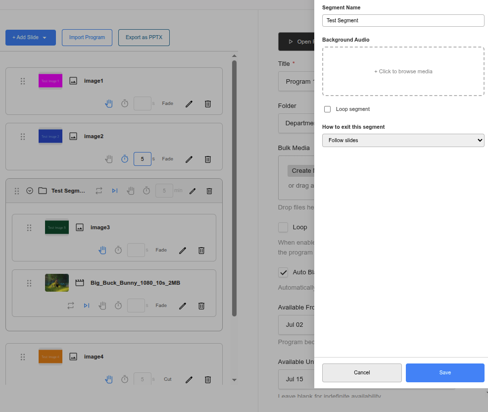

**Creating a Segment:**
1. Click **"+ Add Slide"** and choose **Segment** (below the divider).
2. A segment is added to the timeline named "New Segment."
3. Click the  edit button or double-click the segment name to configure it.

**Segment Settings:**
| Setting | What It Does |
|---|---|
| **Segment Name** | A label for the segment (shown in the timeline) |
| **Background Audio** | Audio that plays throughout the segment |
| **Loop segment** | When on, the segment's slides repeat continuously |
| **How to exit this segment** | Follow slides (normal), Timer (auto-exit after N minutes), or Manual (wait for operator) |

**Adding slides to a segment:**
- Drag slides from the top level into the segment.
- Click the **+ Add Slide** button inside the segment.
- Drop media from the Media Browser directly onto the segment.

**Moving slides between segments:**
1. Open the slide's Edit Drawer.
2. Use the **"Move to segment"** dropdown to select a target segment or "Top level."

**Collapsing/expanding:**
- Click  to collapse or  to expand the segment in the timeline.

**Removing a segment:**
- Click the  button on the segment header. This removes the entire segment and all its slides. A confirmation dialog will appear.

### Importing Slides from Another Program

1. Click **"Import Program"** in the timeline header.
2. A modal opens showing other programs you can import from.
3. Search for a program by title.
4. Click on a program to import all its slides — they'll be appended to the end of your timeline.

### Exporting as PowerPoint

Click **"Export PPTX"** in the timeline header to download the program as a `.pptx` file. This is only available on saved programs.

### Program Settings (Sidebar)

When editing a program, you'll find these settings in the sidebar:

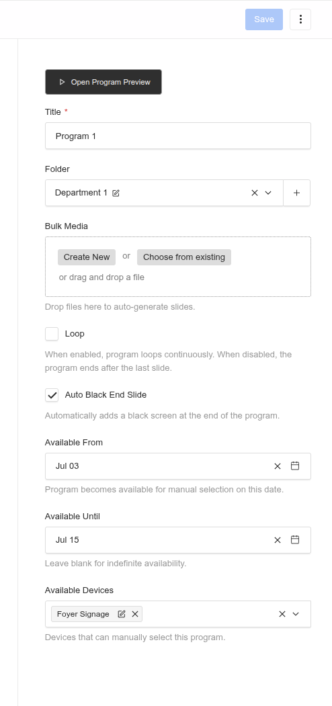

| Setting | What It Does |
|---|---|
| **Title** | The program name — shown in schedules and on devices |
| **Open Program Preview** | Opens a full-screen preview of the program |
| **Folder** | Which programs folder this belongs to (you can change this on edit) |
| **Loop** | When on, the program plays from the beginning after the last slide. When off, the program ends after the last slide. |
| **Auto-black end slide** | When on (default), a black screen is automatically added at the end so the program doesn't abruptly cycle. This only applies when Loop is off. |
| **Available From** | The date this program becomes available for manual selection on devices |
| **Available Until** | The end date for manual availability. Leave blank for indefinite. |
| **Available Devices** | Select which devices can manually select this program from their menu |

### Deleting Slides

- Click the  button on any slide card to remove it.
- A confirmation dialog will ask "Remove this slide?"

---

## Schedule Programs to Devices

There are two ways a program gets on a device:

- **Scheduled (automatic)** — A schedule tells the device to start playing a program at a specific time. The program begins automatically — no one needs to be at the device. This is what we're setting up here.
- **Available (manual)** — By adding a device to a program's "Available Devices" list (in the program sidebar), the program appears in the device's on-screen menu. An operator can then select it using Remote Control or the device's keyboard.

When you create a schedule, the program will **automatically begin playing** on the selected devices at the scheduled time — no action needed at the device.

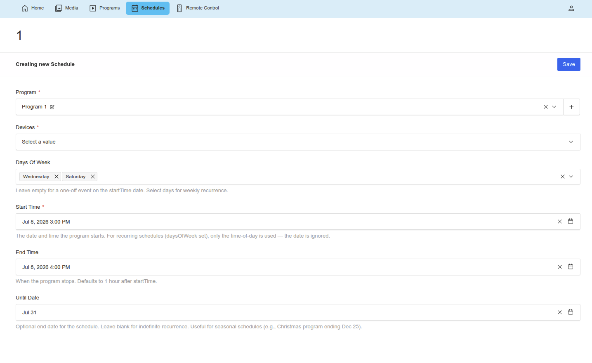

### Creating a Schedule

1. Click **Schedules** in the top navigation.
2. Click **Create** to create a new schedule.
3. Fill in the fields:
   - **Program** — Select a program from your department's programs.
   - **Devices** — Select one or more devices from your department's devices.
   - **Start Time** — The date and time the program should start playing (in 15-minute intervals).
   - **End Time** — When the program should stop. If left blank, it defaults to 1 hour after the start time.
4. Click **Save**.

### One-Off vs Weekly Recurring

**For a one-time event:**
- Leave the **"Days of Week"** field empty.
- The program will play once on the date and time you specified.

**For a weekly recurring schedule:**
- Select one or more days of the week (Monday through Sunday).
- The program will play every week on those days at the specified time.
- The date in "Start Time" is ignored for recurring schedules — only the time matters.

**Example:** To schedule a program for every Sunday at 9:00 AM:
- Select **Sunday** in Days of Week.
- Set Start Time to 9:00 AM.
- Set End Time to 10:00 AM (or your desired end time).

### Setting an End Date for Recurring Schedules

Use the **"Until Date"** field to set a date when the recurring schedule should stop. This is useful for seasonal content.

**Example:** A Christmas program that should play Mondays through Fridays from December 1 to December 25:
- Days of Week: Mon, Tue, Wed, Thu, Fri
- Start Time: 8:00 AM
- End Time: 12:00 PM
- Until Date: December 25

Leave "Until Date" blank for schedules that should continue indefinitely.

### Schedule Overlaps

The system automatically prevents you from creating schedules that conflict. If you try to save a schedule that overlaps with an existing one on the same device, you'll see this error:

> "This entry overlaps with an existing schedule on one of the selected devices."

To fix this:
- Change the start or end time.
- Select different days of the week.
- Choose different devices.

### Notes

- The **Department** field is hidden and automatically set based on the program you selected.
- You can only schedule programs from your own department(s).
- You can delete any schedule in your department(s).

---

## Remote Control

Remote Control lets you take manual control of what's playing on a device in your department.

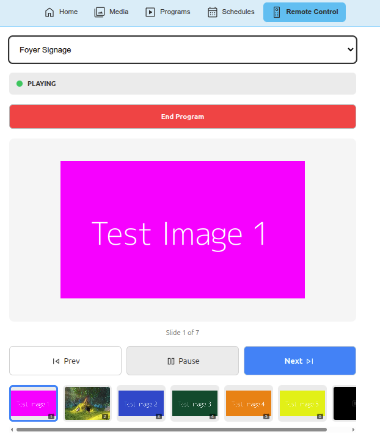

### Opening Remote Control

- Click **Remote Control** in the top navigation, or
- From the Dashboard, click the **"Remote Control"** button on any device card.

### Selecting a Device

Use the device dropdown to select which device you want to control. If you came from the Dashboard, the device may already be selected.

### Controlling a Playing Program

When a program is actively playing on the selected device, you'll see:

- **Status badge**: PLAYING (green dot)
- **Slide preview**: A thumbnail of the current slide
- **Slide position**: "Slide N of Total"

**End Program button:**

A separate full-width red button appears above the slide preview.  **End Program** stops the program entirely. You'll be asked to confirm.

**Playback controls:**

Below the slide preview, three main controls:

| Button | What It Does |
|---|---|
|  **Prev** | Go to the previous slide |
|  **Pause** | Pause the current slide |
| **Next**  | Advance to the next slide. On the last slide, this changes to  **End** and ends the program. |

**Jumping to a slide:**
- A **slide thumbnail strip** appears at the bottom showing all slides in the program.
- The current slide has a blue border.
- Click any thumbnail to jump directly to that slide.

### Loading a Program onto an Idle Device

When no program is playing on the selected device:

1. Select a program from the **program dropdown**. This shows:
   - Programs from the device's scheduled times
   - Programs that have this device in their "Available Devices" list
2. Click **Load Program** to start it on the device.

### Real-Time Updates

The Remote Control page updates in real-time — you don't need to refresh to see changes. When someone else starts or stops a program, or when a schedule triggers, you'll see the status update automatically.

---

## Dashboard

The Dashboard is your home page. It gives you a quick overview of everything happening in your department(s).

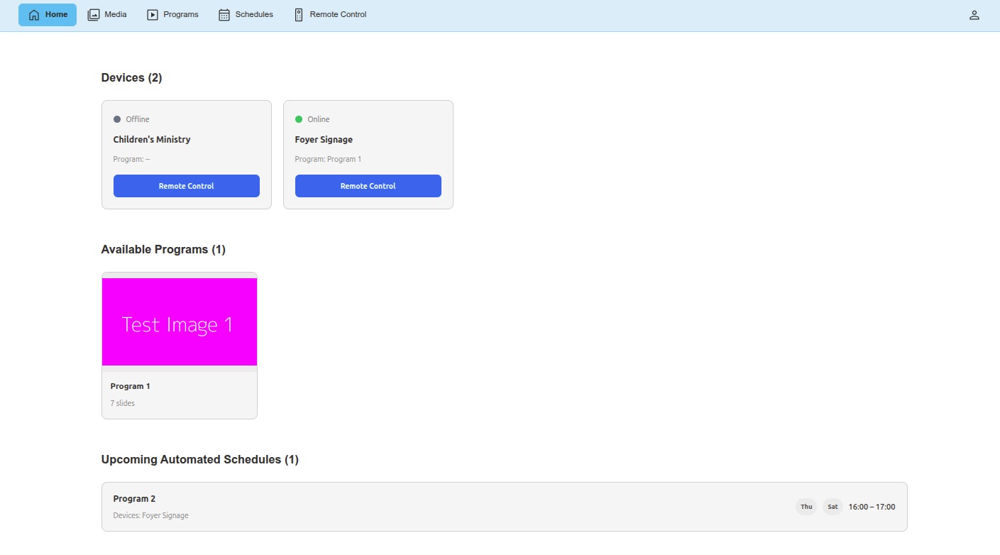

### Devices Section

Cards showing each device in your department(s):

- **Status**: Online (green), Stale (amber), or Offline (gray)
- **Current Program**: What's playing right now (or "--" if idle)
- **Remote Control** button: Jump to Remote Control for that device

Status updates in real-time.

### Available Programs Section

Programs that are currently within their availability window (Available From date has passed and Available Until date hasn't yet). Each card shows a thumbnail, title, and slide count. Click a card to edit the program.

### Upcoming Programs Section

Only shown when there are programs becoming available within the next 2 days. Displays program cards with thumbnail, title, slide count, and a link to the program edit page.

### Upcoming Schedules Section

A list of upcoming automated schedules showing:
- Program title
- Device names
- Day-of-week pills (Mon, Tue, etc.)
- Time range

Click a schedule to view or edit it.

---

## Tips & Common Questions

**What content can I see?**
You can only see media, programs, and schedules that belong to your department(s). If you're in multiple departments, you'll see content from all of them.

**Who can delete things?**
You can delete media, programs, schedules, and folders in your department(s). Only administrators can delete users and devices — contact an admin if you need those removed.

**What happens when I delete media?**
The system automatically cleans up references to deleted media in programs. Any slides that used the deleted media will become empty.

**How do I make a program play automatically on a schedule?**
Create a Schedule (see [Schedule Programs to Devices](#schedule-programs-to-devices)) and select the program and device(s). The device will automatically switch to the program at the scheduled time.

**How do I make a program manually available on a device?**
In the program's sidebar, add the device to the **"Available Devices"** field. The device will show this program in its manual selection menu.

**What is a Segment?**
A Segment groups slides together with shared settings like background audio and looping. It's useful for things like a worship set — put all the songs in one segment with background audio, and the segment can loop independently or exit after a timer.

**What advance mode should I use?**
- **Timed** — Good for images that should display for a fixed time (e.g., announcement slides at 5 seconds each).
- **Manual** — Good for slides that should wait for an operator to advance (e.g., during a live presentation).
- **On End** — Good for video and audio slides that should play to completion before moving on.

**What is the auto-black end slide?**
When enabled (the default), the system adds a black screen at the end of your program. This prevents the program from jumping back to the start. The black screen requires manual advance to exit, so the display gracefully pauses between programs.

**How do I change my password?**
Click the Account icon in the top-right and enter your current and new password. See [Changing Your Password](#changing-your-password).

**Why am I getting an overlap error when creating a schedule?**
The device you selected already has a schedule that conflicts with the times you entered. Try adjusting the start/end time, choosing different days, or selecting different devices.

**What does "Stale" device status mean?**
A stale device has connected to the server recently but may not be fully up-to-date. It usually resolves on its own. "Offline" means the device hasn't checked in for a while.